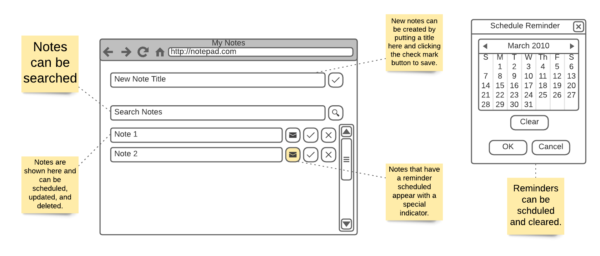

# Unison Senior Software Engineer For Backend Mini-Project
For this mini-project you will create an API and system documentation for the backend part of a fictional application.
The application is a simple note-taking application that can also be used to set reminders. The included user interface
makes calls to a RESTful API to perform CRUD operations. You should implement a simple API that can respond to these
CRUD operations. The system also describes a reminder mechanism that allows the user to set a date and time and on that
date and time an email will be sent to the user. The reminder system does not need to be implemented but should be
included in the documentation. A full technical design document should be created for the API as well as the reminder
system.

_**Please fork this repository and send us the Github link when you are finished. Be prepared to present your
documentation and recommendations to a small team. The repository should be made available 24 hours prior to your
scheduled presentation.**_

## The Requirements
The notepad application allows a user to create notes and set an optional reminder for each note. The user can modify
and delete notes as well as search for notes viewing only notes containing the search text. A reminder can be set on a
note that is defined by the date when an email should be sent with the note text as the body.

The UI Application is expecting a note structure to have the following fields:

|Field|Type|Description|
|---|---|---|
|id|string|This is the ID of the note as generated on the server.|
|title|string|This is the body of the note can can be a string of up to 200 characters in length.|
|schedule|string|This is the schedule of the reminder and can be an ISO-8601 date string including time.|

The reminder date and time will be used to send an email message to the user when that date and time passes. The body
of the email will contain the title of the note.

### The User Interface
The user interface is described in the following diagram.



### The Notepad API Definition
The Notepad API should contain full CRUD operations. The following table described the endpoints expected by the UI:

|HTTP Method|Path|Description|
|-----------|----|-----------|
|GET|/notes|This will retrieve notes from the server. A `query` query string variable can be set to filter the notes.|
|GET|/notes/{id}|This will retrieve a note with the given ID.|
|POST|/notes|This will create a new note from the JSON value in the payload.|
|PUT|/notes/{id}|This will update the note with the given ID using the JSON value in the payload.|
|DELETE|/notes/{id}|This will delete the note with the given ID.|

When creating a note a title must be included and should not include an ID. The ID should be generated by the server.
The title can be between 1 and 200 characters long. When updating a note you should include an ID, and it must match the
ID in the URL path. Updates can be sparse and only include the data you wish to update. Omitting data will keep the
existing data intact.

#### Running The UI

Your server should run on port 3000. When you have a working server you can run the UI Application and it will
communicate with your server on port 3000. Start your server first and then run the UI Application by executing the
following commands from the `client` directory:

```shell
npm install
npm start
```

You should be able to execute the UI including refreshing the page to retrieve the current dataset. You do not need to
persist the data if your server process exits but should persist for the lifetime of the process.

# The Project
What we would like are the following items created by you:
* A working API server written in Node.js that can be run from the `api` directory. The source code should be included
  in a fork of this repository. Documentation should be included that tells us how to execute the API. The `tests`
  directory contains integrations tests that can be used to verify your API matches the specification.
    
* Technical documentation should be written about the API and the reminder system. The reminder system should be fully
  documented in a way that allows other engineers and stakeholders know how the system should be implemented. The
  documentation should be complete enough to be able to give an accurate estimated level of effort to complete and
  represent a production level system. The documentation can be written as markdown files or other files inside the
  `docs` directory or simply a link to Google or another cloud based document(s).
  
* Any other documentation you think will help us in understanding your work can also go into the
  `docs` directory.
  
* As a bonus, a future version of the application will allow account creation and login. Feel free to include this in
  your documentation, but it is not required.
  
We will assess your written communication skills and your ability to communicate technical ideas from the
documents you create. Your coding skills will be assessed from the API you create. Feel free to make this as complete
as you wish and include any other technologies you see fit but do write the server in Node.js. Also, we use Hapi.js here
at Unison, host in AWS, and use mostly Serverless technologies, but you do not need to in this project.

If you have any questions then please reach out to our HR representative.
